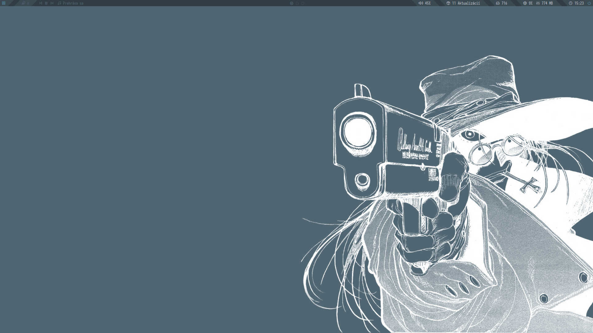
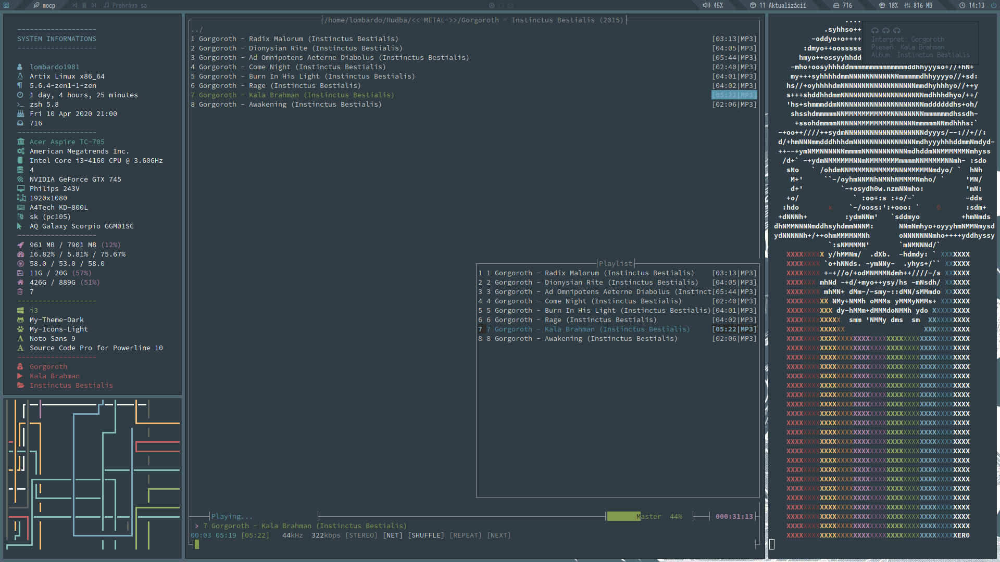

# Dotfiles

I'm just me. A girl in love with Arch, cyberpunk, metal, singing and Slovak cuvac.

# System informations

* **Distro:**  Artix Linux

* **WM:**  i3-gaps

* **Panel:** polybar 

* **Locker:**  i3lock-fancy

* **Emulator:** termite 

* **Notify**: dunst 

* **Running:** sys-info-full, pipes, moc, color-scheme-skull 

# Screenshots

# All details

| **Items** | **Values** |
| ------ | ------ |
| Display Server | xorg |
| Display Manager | none (automatic login to virtual console on [artix](https://wiki.manjaro.org/index.php?title=Autostart_X_at_Login_-_OpenRC_%26_SystemD#How_to_Auto-Login_on_an_OpenRC_system) or [artix](https://forum.artixlinux.org/index.php/topic,120.0.html) or [arch](https://wiki.archlinux.org/index.php/Getty#Automatic_login_to_virtual_console)) |
| Window Manager | [i3-gaps](https://github.com/Airblader/i3) based on [i3](https://i3wm.org/) |
| Policy Kit | lxpolkit provided by lxsession |
| Status Bar | [polybar](https://github.com/polybar/polybar), [py3status](https://github.com/ultrabug/py3status), [i3blocks](https://github.com/vivien/i3blocks) |
| Lock Screen | [i3lock-fancy](https://github.com/meskarune/i3lock-fancy) |
| GTK Theme | edited Numix |
| QT4 Theme | GTK provided by [Trolltech.conf](https://wiki.archlinux.org/index.php/Qt#Qt4) |
| QT5 Theme | GTK provided by [qt5-styleplugins](https://wiki.archlinux.org/index.php/Qt#Qt5) |
| Icon Theme | ------ |
| Fonts | [Noto](https://www.google.com/get/noto/), [iosevka](https://github.com/be5invis/Iosevka), [awesome](https://fontawesome.com/cheatsheet) ([nerd-fonts](https://github.com/ryanoasis/nerd-fonts)) |
| GTK Themer | lxappearance |
| Background Handler | [feh](https://github.com/derf/feh) |
| Notification Daemon | [dunst](https://github.com/dunst-project/dunst) |
| Menu | [rofi](https://github.com/davatorium/rofi) |
| Power Manager | xfce4-power-manager, [tlp](https://github.com/linrunner/TLP) |
| Sound | alsa |
| Sound Control | pavucontrol |
| Sound Equalizer | [pulseaudio-equalizer-ladspa](https://github.com/pulseaudio-equalizer-ladspa/equalizer) based on [swh-plugins](https://github.com/swh/ladspa) |
| Network Manager | connman |
| Terminal | [termite](https://github.com/thestinger/termite/) |
| Terminal Colorscheme | [created by me](https://gitlab.com/lombardo1981/dotfiles/-/blob/master/Artix%20Linux/.config/colors/colorscheme) ([preview](https://gitlab.com/lombardo1981/dotfiles/-/blob/master/Screenshots/colorscheme.png) by [blocks](https://github.com/stark/Color-Scripts/blob/master/color-scripts/bloks) ) |
| Shell | zsh |
| Shell Theme | [created by me](https://gitlab.com/lombardo1981/dotfiles/-/blob/master/Artix%20Linux/.zsh_prompt) ([preview](https://gitlab.com/lombardo1981/dotfiles/-/blob/master/Screenshots/zsh-prompt.png)) |
| Powerline Theme | [edited](https://gitlab.com/lombardo1981/dotfiles/-/blob/master/Artix%20Linux/.zsh_powerline) [powerlevel9k](https://github.com/Powerlevel9k/powerlevel9k) ([preview](https://gitlab.com/lombardo1981/dotfiles/-/blob/master/Screenshots/zsh-powerline.png)) |
| Screenshot App | scrot, [flameshot](https://github.com/lupoDharkael/flameshot) |
| System Optimizer | bleachbit |
| System Monitor | htop |
| File Manager | thunar, [ranger](https://github.com/ranger/ranger) |
| Text Editor | gedit2, nano, vim |
| Image Viewer | [viewnior](https://github.com/hellosiyan/Viewnior) |
| Music Player | [moc](http://moc.daper.net/) |
| PDF Viewer | evince-light |
| Archiver | file-roller |
| Office Suite | [OnlyOffice DesktopEditors](https://github.com/ONLYOFFICE/DesktopEditors) |
| Image Editor | gimp |
